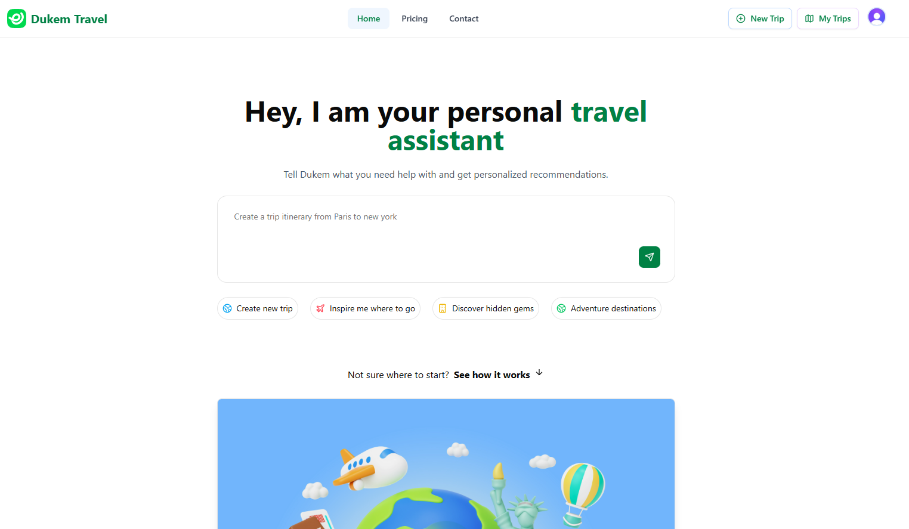
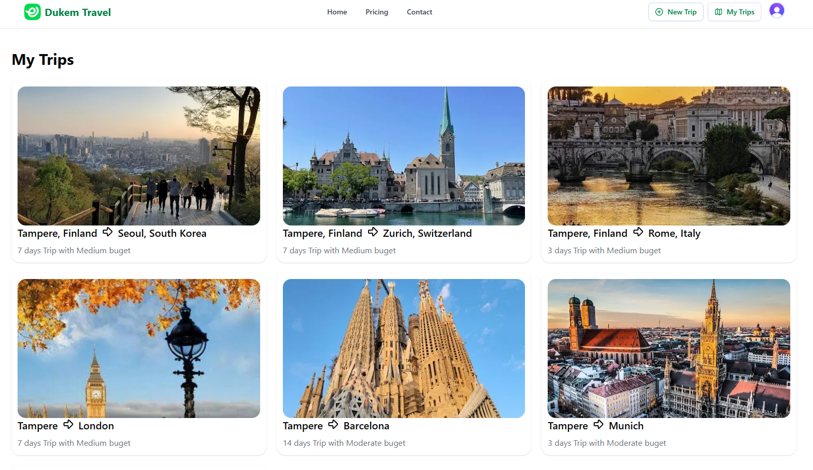

# Dukem Travel

An AI-powered travel planning platform that creates personalized trip itineraries through natural conversation. Built with Next.js 15, React 19, and advanced AI technology.

**Live Demo:** [https://dukem-travel.vercel.app/](https://dukem-travel.vercel.app/)

## Screenshots


*AI-powered conversational trip planning interface*


*Detailed day-by-day itinerary with hotels and activities*


*Explore your trip on an interactive Mapbox visualization*

## Features

- **Conversational AI Planning** - Natural language trip planning with intelligent multi-step data extraction
- **Personalized Itineraries** - Custom day-by-day plans based on budget, interests, and travel style
- **Interactive Maps** - Visualize your entire journey with Mapbox GL integration
- **Hotel Recommendations** - Curated accommodations matching your budget tier
- **Real-time Collaboration** - Convex-powered database for seamless trip management
- **Smart Rate Limiting** - Arcjet protection with user-based token buckets

## Tech Stack

**Frontend**
- Next.js 15 (App Router)
- React 19
- Tailwind CSS v4
- shadcn/ui components
- Mapbox GL

**Backend & Services**
- Convex (Real-time database)
- Clerk (Authentication)
- OpenAI via OpenRouter (AI trip generation)
- Arcjet (Rate limiting & security)
- Google Places API (Location imagery)

## Getting Started

### Prerequisites

- Node.js 20+ 
- npm/yarn/pnpm

### Installation

1. Clone the repository
```bash
git clone https://github.com/vvduth/dukem-travel.git
cd dukem-travel
```

2. Install dependencies
```bash
npm install
```

3. Set up environment variables

Create a `.env.local` file with:
```env
NEXT_PUBLIC_CLERK_PUBLISHABLE_KEY=
CLERK_SECRET_KEY=
CONVEX_DEPLOYMENT=
NEXT_PUBLIC_CONVEX_URL=
OPENROUTER_API_KEY=
ARCJET_KEY=
NEXT_PUBLIC_MAPBOX_API_KEY=
GOOGLE_MAPS_API_KEY=
```

4. Start Convex development server
```bash
npx convex dev
```

5. Run the development server
```bash
npm run dev
```

Open [http://localhost:3000](http://localhost:3000) to see the application.

## Project Structure

```
dukem-travel/
├── app/                    # Next.js app directory
│   ├── api/               # API routes (aimodel, arcjet, google-place-detail)
│   └── provider.tsx       # Global context providers
├── components/            # React components
│   ├── ChatBox.tsx       # AI conversation interface
│   ├── FinalUI.tsx       # Trip plan display
│   └── ui/               # shadcn/ui components
├── constants/
│   └── prompts.ts        # AI system prompts (SYSTEM_PROMPT, FINAL_PROMPT)
├── convex/               # Convex database schema and functions
├── lib/                  # Shared utilities (openai, arcjet)
└── types/                # TypeScript type definitions
```

## Key Features Explained

### Two-Phase AI System

1. **Conversational Gathering** - The AI asks contextual questions to collect trip details (origin, destination, budget, interests)
2. **Itinerary Generation** - Once complete, generates a detailed JSON trip plan with hotels, activities, and geo-coordinates

### Generative UI

The chat interface dynamically renders interactive components based on AI responses:
- Group size selector
- Budget tier picker
- Trip duration counter
- Final trip visualization

### Rate Limiting

Implements Arcjet token bucket system:
- 10 tokens per user per day
- 1 token per conversation message
- 5 tokens per complete itinerary generation
- Premium users bypass limits

## Development

### Building for Production
```bash
npm run build
npm start
```

### Common Tasks

**Add new conversation step:**
1. Update `SYSTEM_PROMPT` in `constants/prompts.ts`
2. Add UI case in `ChatBox.tsx`
3. Create corresponding component in `components/`

**Modify trip schema:**
1. Update interfaces in `types/index.ts`
2. Adjust `FINAL_PROMPT` JSON schema
3. Update rendering in `FinalUI.tsx`

## Contributing

Contributions are welcome! Please feel free to submit a Pull Request.

## License

This project is open source and available under the [MIT License](LICENSE).

## Acknowledgments

- Built with [Next.js](https://nextjs.org/)
- UI components from [shadcn/ui](https://ui.shadcn.com/)
- Maps powered by [Mapbox](https://www.mapbox.com/)
- AI by [OpenAI](https://openai.com/) via [OpenRouter](https://openrouter.ai/)
